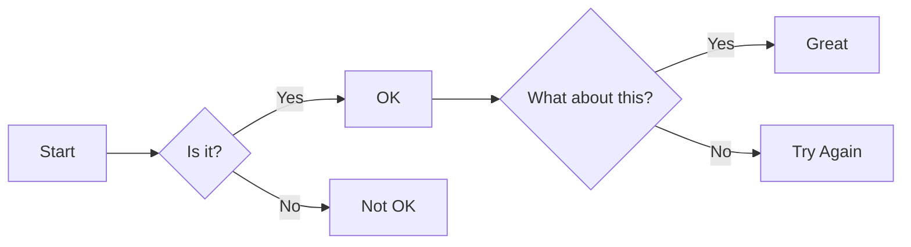
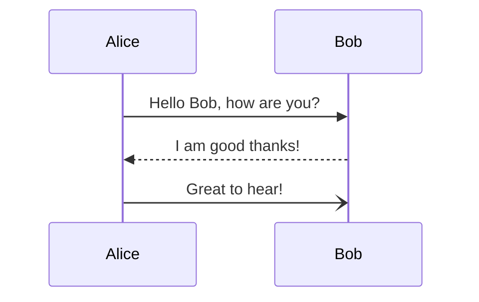
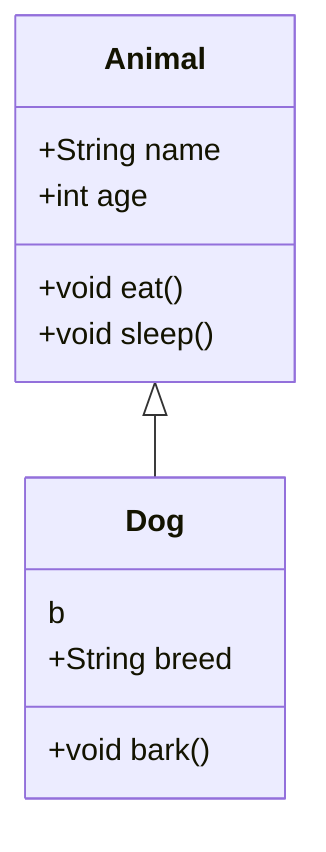
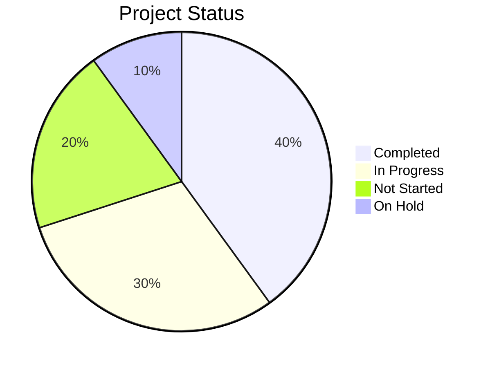

## Примечания
- команд шифт в предпросмотр

```mermaid
    graph LR
        A[Start] --> B{Is it?}
        B -->|Yes| C[OK]
        B -->|No| D[Not OK]
        C --> E{What about this?}
        E -->|Yes| F[Great]
        E -->|No| G[Try Again]
```

```mermaid
    sequenceDiagram
        participant Alice
        participant Bob
        Alice->>Bob: Hello Bob, how are you?
        Bob-->>Alice: I am good thanks!
        Alice-)Bob: Great to hear!
```

```mermaid
    classDiagram
        class Animal {
            +String name
            +int age
            +void eat()
            +void sleep()
        }
        class Dog {b
            +String breed
            +void bark()
        }
        Animal <|-- Dog
```

```mermaid
    pie
        title Project Status
        "Completed" : 40
        "In Progress" : 30
        "Not Started" : 20
        "On Hold" : 10
```

