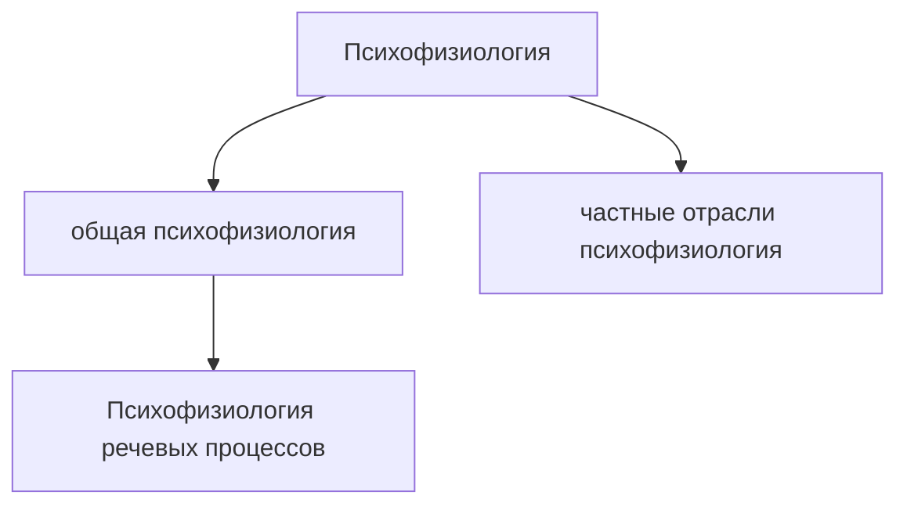

**Лектор:** Кисельников Андрей Александрович  
**Контакт:** kiselnikov@mail.ru  

### Лекция 1 - Введение

Наша задача - моделировать процессы на уровне нейронов. Это сложно, так как нейроны очень маленькие, и это возможно только медицинскими методами. Мы можем использовать МРТ и ЭЭГ, но они дают лишь общую картину.

Речь - это очень сложная и поздно возникшая функция, которая сложно локализуется в мозге. Поэтому медицинские данные по отдельным нейронам у животных очень полезны. Если не удается спуститься до уровня нейронов, мы рассматриваем группы, такие как мозжечок, и соединяем их.

В области психофизиологии мы залезаем в мозг и пытаемся объяснить законы, открытые психологами

Есть много смежных нейронаук: нейролингвистика - по базе лингвисты - поттягивают мозг и пытаются объяснить свои законы через его деятельность и процессы (пример - Татьяна Владимировна Черниговская, Хомский тоже этим занимается отчасти ((хотя я слышал он не любит эксперименты))), нейропсихология (включает следующую), афазиология (поражения речи), физиология ВНД, нейрогенетика

Мы будем (в том числе) работать в рамкой Лурьевской нейропсихологии (в честь Александра Романовича Лурия, рассматривает взаимодействие структур, динамически локализует)

Есть также классическая и Павловская система. Говорит что Павлов ввел вторую сигнальную систему, я думал это сделал канеман, нужно проверить - действительно придумал Павлов, канеман изучал смежную область и написал книжку

Нейропсихология речи - это выходцы из биологии, которые начали заниматься науками о мозге?

Речь в том числе генетически детерминированна, есть исследования в области локализации генов отвечающих за речь и за речевые нарушения

Есть наука, которая сравнивает то что происходит внутри ллмок и внутри мозга - психофизиология искуственного интеллекта.

Черниговская включает в нейролингвистику мышление - это спорно

Методы психофизиологии речевых процессов
1) Электроэнцефалография - ставим электроды на голову, которые снимают суммарное электрическое поле которое пораждается работой нейронов мозга. Придумано 100 лет назад - доподлинно не известно что пораждает ЭЭГ. По ЭЭГ можем понять, какие структуры пораждают электрическую активность. Метод используется очень активно для исследования речи. 

Бывает импрессивная и экспрессивная речь - импрессивная это восприятие, экспрессивная это порождение.
Импрессивную записывать легче чем экспрессивную. Можно пытаться фиксить с помощью машинного обучения - разные фонемы по разному порождают артефакты. 

2) Вызванные потенциалы и связанные с событиями потенциалы - предъявляем человеку много раз один и тот же стимул, после этого мы усредняем то что осталось. Решая обратную задачу можем определить какие структуры решают эту проблему. Это тоже ЭЭГ. Тут можно тоже работать с экспрессивной речью. Если усреднять до - можно посмотреть кривую потенциала готовности - кажется про это был эксперимент с отсутствием свободы воли.

3) Магнитноэнцефалография (МЭК) - как ЭЭГ, но магнитное а не электрическое поле. МЭК очень дорогой. Еще он бесконтактный. Он довольно неглубокий, затрагивает только кору, не идет глубже. Это дает плюс с точки зрения локализации источника. Большое темпоральное разрешение - тысяча раз в секунду

Нейрон порождает потенциал действия - спайк, это бывает 100 200 гц, но обычно меньше. Если спайки меньше 100 герц, темпоральное разрешение ЭЭГ и МЭГ позволяет захватить это.

Мозгу тяжело координировать тонкие движения речевых мышц для порождения речи.

Технология ЭЭГ сейчас переходит на сухие электроды - так будет проще изучать речь

4) Функциональная томография (фМРТ, ПЭТ - позитронная эмиссионная томография) - по кровотоку понимаем, какие зоны мозга активируются
В ПЭТ вкалывается или вдыхается радиоактивная метка (например меченная глюкоза), изотоп распадается и мы видим приток крови к зонам которые работают активнее.
фМРТ связан с изменением прецессии ядер водорода в магнитном поле. Есть баланс оксигемоглабина и дезоксигемоглабина. В месте где происходит активность заметен дисбаланс.
У этих методов есть проблема с темпоральным разрешением (полторы - две секунды)
При этом у них лучше пространственное разрешение.
фМРТ и ЭЭГ иногда совмещают в один прибор чтобы получить лучшее разрешение из обоих. 

Функциональная томография (фМРТ) изменило психофизиологию коренным образом - что-то подтвердилось, что-то было откинуто и заменено

5) Структурная томография (МРТ, КТ)
Эти методы изобретены раньше - просто видим 3д послойную модельку мозга. кт это рентген который делается много раз, мрт сделан на основе прецессии протонов водорода в магнитном поле
До конца 70х годов только нейропсихолог мог объяснить хирургу, в каком месте мозга опухоль (если она в сложном месте). Потом мрт и кт изменили отрасль. Бывают тонкие дефекты, которые не увидишь на мрт или кт - например изменение речи при психических заболеваниях. Только сейчас методы машинного обучения начинают помогать нам в этом. 

Шизофрения - это дисбаланс нейромедиаторов. Нейрохимию сложно увидеть на мрт или кт. 

6) Изучение локальных поражений мозга
Любое нарушение показывает, какая функция была локализована в этой зоне мозга. Мозг сложно устроен, там тысячи разных модулей которые взаимодействуют друг с другом. Если что-то выпадает - мы понимаем, что есть модуль отвечающий за это (например, цветовое восприятие). Разнообразие инсультов и микроинсультов дает разнообразие возможных выбиваний. 

Спрашивают про внутреннюю речь - будем обсуждать далее.

Говорим про расстройства речи
Шизофазия - это дефекты префронтальной коры в регуляции речи
Шизофрения нарушается при шизофрении, в том числе мотивация к речи
Мутизм - это отказ от речи

Речевая система она в целом достаточно очерчена - можно наложить на мозг картинку широкой речевой системы и понять где именно она находится.

В истории психологии большинство функций мозга изучались через локальные нарушения.

7) Интраоперационное картирование
вскрываем череп, тыкаем электродиком, проверяем реакцию. Пэнтфильд - канадский нейрохирург, делал операции на открытом мозге. Так он составил первую карту речи в середине 50х годов.

Рекомеднует книгу Баасвейдж - мозг познание разум
Психофизиология александров