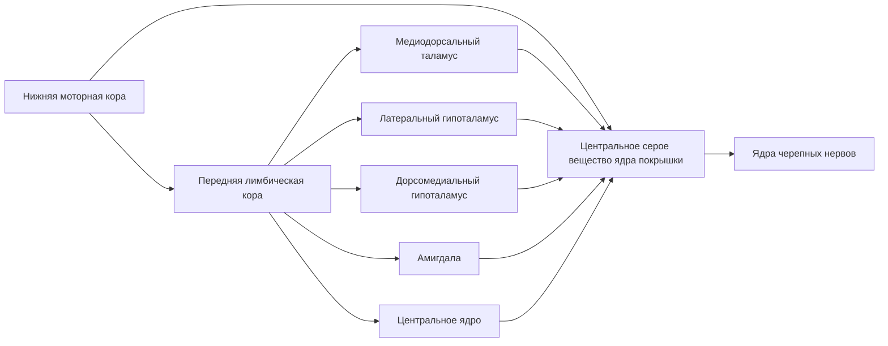

Экстралингвистика ребенка - может указывать на конкретного человека, мать или бабушка

Потом у ребенка включается формирование понятий. Лепет и гуление ребенка трансформируется в слоги, потом в слова, потом в истинные понятия. Левополушарные зоны начинают играть все более важную роль. 

Красивая правильная речь интегрирует и левое, и правое полушарие.

Правое полушарие догоняет левое, и с возрастом начинает происходить обратный процесс - правое полушарие перегоняет левое. Важнее выразить эмоцию, чем вести диалог на высоком смысловом уровне.

Еще один сюжет - жестовые афазии у глухонемых. У них тоже бывают инсульты и все такое. При дефектах левого полушария возникает афазия движений руки.

Система звукогенерации у обезьян позволит нам понять подкорковую базу генерации речи.

Схема у Плуга получилась такая

Ядра покрышки интегрируют все сигналы.

Кора скрыла подкорку, потом появилась префронтальная кора - каждый раз управляющие функции перемещались в последнюю развившуюся область.

Механизм лимбики - гиппоталамус, миндалины, таламус, АЦЦ - это то, что контролирует мотивацию. Когда в метро наступают на ногу - резкая реакция не контроллируется корой, идет оттуда.

Схема переложенная на человека отвечает за регуляцию поведения.

Центральность - характеристика того, насколько узел управляет.

Собаки понимают речь.

Противоречивый сигнал - шизофрения. 